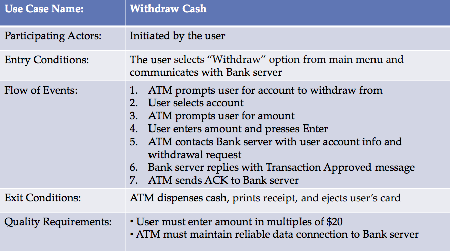

# Introduction to Software Engineering
# Requirement Specification Tutorial

Rami Sayar [@ramisayar](http://twitter/ramisayar)

[Talks](github.com/sayar/talks) If you find a mistake, don't hesitate to fork the repository, clone it to your local machine, edit the mistake, git commit -a -m and then press the pull request button to notify me.

## Introduction

In this tutorial, we are going to review some of the concepts introduced in the lecture with regard to requirement specification. The tutorial will be split into two sections: requirements analysis and requirement modeling. In this tutorial, however, we will spend most of our time analyzing IEEE 830 as your project requirements should be based on that standard.

## Requirement Analysis

### Why Requirement Specification?

Why are requirement specifications important? Let's take an example of what could happen when specification documents are not clear.

<iframe width="420" height="315" src="http://www.youtube.com/embed/_yZHbh396rc" frameborder="0" allowfullscreen></iframe>

The video describes problems in the Ruby and JavaScript language interpreters. Language definitions are for the most part well specified, however, there are always gaps even in professional requirements specification. Although, in this case, language definitions get very technical about how languages should be implemented. The principle remains the same, without great specs, you can fall into gaps.

The goal of a requirement specification is to document and negotiate what the software system is required to do. Requirement specifications do not describe the implementation of a system, only what the customer needs the system to do.

### Principles for Writing Good Specifications

* Correct - Describes what the customer wants…
* Consistent - No conflicts between requirements
* Unambiguous - One way only
* Complete - All behavior is specified.
* Testable - Requirement can be tested either systematically or by the user.
* Traceable, Referencable
* Design Free - No implementation specifics
* Relevant - Business logic is important, why do we need this requirement?
* Collaboration between all stakeholders

### Traps to Avoid

Karl Wieger's described 10 common traps in requirement documents.

* Confusion Over "Requirements"
* Inadequate Customer Involvement
* Vague and Ambiguous Requirements
* Unprioritized Requirements
* Building Functionality No One Uses
* Analysis Paralysis
* Scope Creep
* Inadequate Change Process
* Insufficient Change Impact Analysis

[REFERENCE](http://www.processimpact.com/articles/reqtraps.html)

### IEEE 830: SRS

See IEEE 830 file.

## Requirement Modeling

### Functional: Use Cases

Anatomy of a use case:

* Name (verb phrase, concrete)
* Actors (nouns)
* Entry condition (how to enter and where from)
* Flow of events
* Exit condition (clear finishing event)
* Quality requirements

#### Tips for Great Use Cases

* Define your use case actors
* Don't forget the alternate and error flows.

### Dyanmic: State Machine Diagrams

##### Common Confusions

* FSMs have no memory or data store outside the knowledge represented by which state the FSM is currently in.
* Everything that might happen in the system or object being diagrammed happens *inside* the rounded rectangles that stand for the states. Every possible action or event from outside the system is represented as an arrow with accompanying text, with the arrow running from one state to another, or from one state back to the same state.  

[Reference](http://www.eagleridgetech.com/pr_state_diagrams.html)

## References
* [Karl Wiegers Describes 10 Requirements Traps to Avoid](http://www.processimpact.com/articles/reqtraps.html)