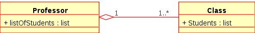
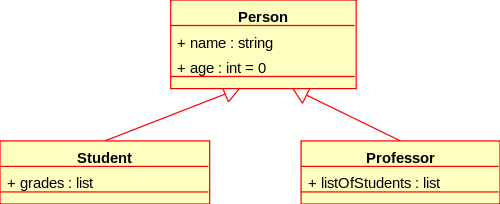

# Introduction to Software Engineering
# UML Tutorial

Rami Sayar [@ramisayar](http://twitter/ramisayar)

[GitHub Talks](github.com/sayar/talks) If you find a mistake, don't hesitate to fork the repository, clone it to your local machine, edit the mistake, git commit -a -m and then press the pull request button to notify me.

## Introduction

In this tutorial, we will learn about Unified Modeling Language (UML). 

UML is a general-purpose modelling language used to represent object-oriented designs and complex software. It is popular in industry and you will often be asked in interviews to solve a problem using UML.

UML allows you to model a software system and visually represent both structural and behavioral views. This stands in sharp contrast with other diagrams such as class diagrams, sequence diagrams, state machine diagrams where the diagram is strictly representing structure or behavior.

A neat thing about UML is that many extensions to the language and UML tools exist, e.g. you can use UML to generate code.

## UML - Software

The software we are going to use for constructing UML diagrams is called [ArgoUML](http://argouml.tigris.org/). It is open source and cross platform. Another great open source alternative is [StarUML](http://staruml.sourceforge.net/en/), however StarUML is Windows only.

## UML - Classes Diagrams

UML Entites such as classes, generics and more are represented using a box with a title. Relationships are represented by lines and arrows.

#### Classes

A UML entity such as a class representes a "concept" with specific attributes and behaviors.

[REFERENCE - Class Diagrams - Wikipedia](http://en.wikipedia.org/wiki/Class_diagram)

#### Types of Relationships

* Association: Describes a relationship between two or more classes. 

[REFERENCE - Class Diagrams - Wikipedia](http://en.wikipedia.org/wiki/Class_diagram)

* Aggregation: An association denoting one object of a class is part of a object of another class. (Bottom in image).
* Composition: An aggregation denoting a strong ownership. (Top in image).

[REFERENCE - Class Diagrams - Wikipedia](http://en.wikipedia.org/wiki/Class_diagram)

* Attributes: Properties of a class.
* Inheritance (or Generalization): Two or more classes share attributes, the attributes are aggregated into one parent class. 

[REFERENCE - Class Diagrams - Wikipedia](http://en.wikipedia.org/wiki/Class_diagram)

#### Difference between Aggregation vs. Inheritance

* Aggregation is a "hard" (a-part-of) relationship. Inheritance is a "soft" (kind-of) relationship.
* Aggregation relates to instances.
* Inheritance relates to classes.

#### 1-to-1, 1-to-Many, Many-to-Many

* A 1-to-1 association guarantees that an object of this class is associated with only one other object of the second class. 
* 1-to-Many association guarantees that an object of a certain class can be associated with many objects of another class.
* Many-to-Many associate guarantees that many objects of a certain class be associated with many objects of another class irrespective of if they are associated with another class.

## References

[Unified Modeling Language](http://en.wikipedia.org/wiki/Unified_Modeling_Language)
[Class Diagrams - Wikipedia](http://en.wikipedia.org/wiki/Class_diagram)

