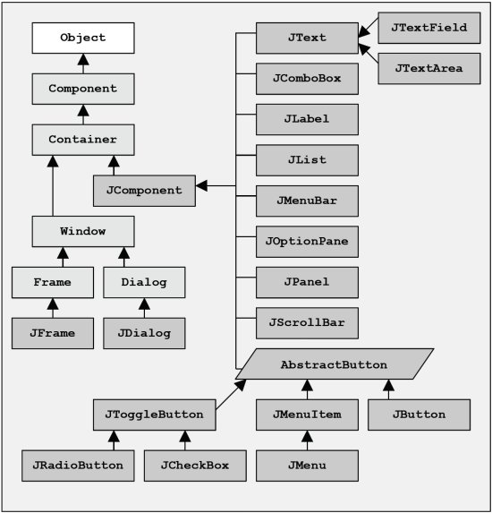

<link rel="stylesheet" href="http://yandex.st/highlightjs/6.1/styles/default.min.css">
<script src="http://yandex.st/highlightjs/6.1/highlight.min.js"></script>
<script>
hljs.tabReplace = '    ';
hljs.initHighlightingOnLoad();
</script>

# Introduction to Software Engineering
# Java Swing

Rami Sayar [@ramisayar](http://twitter/ramisayar)

[GitHub Talks](github.com/sayar/talks) If you find a mistake, don't hesitate to fork the repository, clone it to your local machine, edit the mistake, `git commit -a -m` and then press the pull request button to notify me.

## Introduction

The purpose of these notes is to introduce you to Java Swing. Java Swing is a Java **GUI** widget toolkit. GUI stands for Graphical User Interface. This is the human computer interface that you are most likely familiar with, it is a pictorial interface to a piece of software.

Swing was developed to provide a better library than AWT for building GUI applications in Java. Libraries such as AWT and Swing refer to discrete elements of a UI as components.


## AWT

The **Abstract Window Toolkit** is a part of Java that existed since its conception. All AWT components are mapped to a platform-specific components provided by the operating system window manager API. Thus, AWT components depend on their native code equivalents, called *peers*, but must still be portable and work across several platforms.

`import java.awt.*;`

The look and feel of the components is the same as the native look and feel. AWT is cross-platform as most other Java standard libraries.

AWT has historically been problematic and unstable due to the difficult integration between each native platform (and their differences) with the JVM. This resulted in the development of Swing.

## Swing

Swing is a replacement UI toolkit for AWT. It is built on top of AWT but is a more flexible, robust library.  They are written and drawn in Java, so are not weighed down by the target platform and provide a consistent experience across different platforms. The software as a result is much more portable. Swing also allows programmers to specify the look and feel and unify the look and feel across different platforms. 

`import javax.swing.*;`


## AWT vs. Swing

The principle difference betwee AWT and Swing is that Swing provides *lightweight components* that do not rely on the native GUI and are directly painted onto the canvas using Java code. There are **heavyweight components** which are deeply integrated in the target platform (Windows, X, Mac) but these components tend to not be used as often with the exception of the FileChooser.

## Swing Stack

Swing is built on top of AWT which is in sequence built on top of JFC, Java Foundation Classes. Your application sits on top of Swing but will use classes from AWT on occasion.

## Swing Component Hierarchy

The Swing component inheritance hierarchy is as follows: `java.awt.Component` inherits from `java.lang.Object`, Component defines basic methods such as paint. `java.awt.Container` inherts from `java.awt.Component`. Container provides methods to add other components. `javax.swing.JComponent` inherits from `java.awt.Container`. JComponent is the superclass to most Swing components. Most of a component's basic functionality is thus provided by JComponent.

```
java.lang.Object
  +--java.awt.Component
        +--java.awt.Container
              |
              +--javax.swing.JComponent
              |     +--javax.swing.JButton
              |     +--javax.swing.JLabel
              |     +--javax.swing.JMenuBar
              |     +--javax.swing.JOptionPane
              |     +--javax.swing.JPanel
              |     +--javax.swing.JTextArea
              |     +--javax.swing.JTextField
              |
              +--java.awt.Window
                    +--java.awt.Frame
                          +--javax.swing.JFrame
```


Image courtesy of [Holub](http://www.holub.com/goodies/java.swing.html)



Image courtesy of [JavaTech](http://www.particle.kth.se/~lindsey/JavaCourse/Book/Part1/Java/Chapter06/swing.html)

Methods in all Swing components:

* `public int getWidth()`
* `public int getHeight()`
* `public boolean isEnabled()`
* `public boolean isVisible()`
* `public boolean setEnabled(boolean enabled)`
* `public boolean setVisible(boolean visible)`

## Top-level Containers

Swing has components named "containers" that are used to hold other GUI components. Some of these containers are used for special purposes and others are invisible. Each program that uses Swing has at least one *top-level container*, which acts as the root to the containment hierarchy. This root container tends to be a JFrame in standalone applications (not inside your browser).

The container classes used in Swing applications are: `Component, Container, JFrame, JDialog, JApplet, JPanel`.

* JFrame is a window not contained inside another component. It tends to visually be manifested as the application border and outermost title bar with a close, maximize and minimize buttons and a content pane with holds the UI components. UI components can be added to containers after they are created.
* JDialog is a popup window.
* JApplet is a java container which can be run inside a web browser.
* JPanel is an invisible container used to hold other components or draw graphics. It can also hold other JPanels.

The code license can be found below.

```
package components;
 
import java.awt.*;
import java.awt.event.*;
import javax.swing.*;
 
/* FrameDemo.java requires no other files. */
public class FrameDemo {
    /**
     * Create the GUI and show it.  For thread safety,
     * this method should be invoked from the
     * event-dispatching thread.
     */
    private static void createAndShowGUI() {
        //Create and set up the window.
        JFrame frame = new JFrame("FrameDemo");
        frame.setDefaultCloseOperation(JFrame.EXIT_ON_CLOSE);
 
        JLabel emptyLabel = new JLabel("");
        emptyLabel.setPreferredSize(new Dimension(175, 100));
        frame.getContentPane().add(emptyLabel, BorderLayout.CENTER);
 
        //Display the window.
        frame.pack();
        frame.setVisible(true);
    }
 
    public static void main(String[] args) {
        //Schedule a job for the event-dispatching thread:
        //creating and showing this application's GUI.
        javax.swing.SwingUtilities.invokeLater(new Runnable() {
            public void run() {
                createAndShowGUI();
            }
        });
    }
}
```

## Layout Managers

A layout manager provides structure and positioning to the components in a container, it will control how the UI components are organized. The layout of a container's content pane can be set by called `setLayout`. The layout manager will reorganize the components when the window is resized.

* FlowLayout: Components will arrange themselves from left to right in the order that they were added to the content pane.
* GridLayout: Components will arrange themselves in a grid.
* BorderLayout: Components are arranged in the container in five different areas: North, South, West, East, Center. North, South stretch horizontally. East, West streght vertically. Center stretches in all directions and fills all available space. Default locaiton is Center. If you mistakenly add two components to the same area, only the last one is shown. You don't need to occupy all areas.

## Threading

Threads can be used with Swing applications, however, it must be noted that Swing components are not *thread-safe*. You can work around this by ensure that all Swing components execute in the same "UI thread" which generates and handles events.

```
 public static void main(String[] args) {
    SwingUtilities.invokeLater(new Runnable() 
	{
        public void run() 
		{
     	    createGUI()
        }
    });
}
```

[Swing's Threading Policy](http://docs.oracle.com/javase/6/docs/api/javax/swing/package-summary.html#threading)

## Event Handling

GUIs are event-driven. Swing generates an event whenever the user interacts with the GUI e.g. mouse clicks, key events, mouse movements, focus changes, etc… 

Event classes are: `java.awt.Event` or `javax.swing.Event`. To process an event:

* Register an event listener, the object implements a listener interface.

`component.addActionListener(handler)`

* Implement an event handler, the method to respond to an event. You can have multiple handlers per event.

Swing will delegate an event to be handled to a particular object which has registered as a listener for these events. The listener's event handling method will be called with an event object.

```
public class ButtonClickExample extends JFrame implements ActionListener {
  JButton b = new JButton("Click me!");
  public ButtonClickExample() {
    b.addActionListener(this);
    getContentPane().add(b);
    pack();
    setVisible(true);
  }
  public void actionPerformed(ActionEvent e) {
    b.setBackground(Color.CYAN);
  }
  public static void main(String[] args) {
    new ButtonClickExample();
  }
}
```

## JLabel

JLabel provides read-only text in the GUI. The label's content rarely changes.

```
JLabel myLabel = new JLabel( "Text" )
myLabel.setToolTipText( "Text" )
myLabel.setText( "Text" )
myLabel.getText()
```

## Icon

`ImageIcon` implements an image holder in UI for .gif and .jpeg images.

```
myLabel.setIcon( myIcon );
myLabel.getIcon //returns current Icon
```

## JTextField and JPasswordField

`JTextField` and `JPasswordField` are single line areas where the user can input text into the UI.
You can set a default value and an event is generated for the enter button. You can call a method to get the text out as well. JPasswordField will show all text inputted as * stars.

## JTextArea

Area for manipulating multiple lines of text like `JTextField`.

## JButton

A `JButton` is a component that will generate an action. You should attach a listener to the button to figure out when the button gets clicked.

## JRadioButton

A `JRadioButton` is a radio button that is grouped and represents a selection. You should attach a listener to the button to figure out when a radio button gets selected or the selection changes.

## JCheckBox

A `JRadioButton` is a check box that is checked/unchecked on selection. You should attach a listener to the checkbox to figure out when there is a check change.

## JComboBox

A `JComboBox` is a component that combines a button or editable field and a drop-down list. 

## JPanel

`JPanel` is a generic lightweight container. It is a container and lets you add components to it. Generally, you will create a component and add it to a panel for which a layout manager is set. This will organize and structure the application.

## JWindow

A JWindow is a container that can be displayed anywhere on the desktop. It does not have the title bar, close/minimize/maximize buttons. The window only allows a single content page and this should be set to what you wish the window to hold.

## JFrame

A JFrame is a window with a title, border, (optional) menu bar, close/minimize/maximize buttons and user-specified components. It can be moved, resized, iconified. It is not a subclass of JComponent. It delegates responsibility of managing user-specified components to a content pane.

```
JFrame frame = new JFrame("JFrame Source Demo");
frame.addWindowListener(new WindowAdapter() {
    public void windowClosing(WindowEvent e) {
        System.exit(0);
    }
});
frame.pack();
frame.setVisible(true);
```


## MenuBar and Menus

A menubar is a component that typically appears beneath the title of a frame. It may contain several dropdown menus with menu items. Each menu item when clicked will generate an ActionEvent.

```
JMenuBar myMenuBar = new JMenuBar();
JMenu menu1 = new JMenu("File");
JMenuItem item = new JMenuItem("Exit");

menu1.add(item);
myMenuBar.add(menu1);
frame.setJMenuBar(myMenuBar);
```

## Graphics

JComponents have a paint() method. This is called by the system when it needs to display the component initially and after a resize. You can override paint() to control the appearance of the component by subclassing. The paint method has a Graphics object as a parameter which can be converted into a Graphics2D object.
## Code License

All sample code above has the following license.

```
/*
 * Copyright (c) 1995, 2008, Oracle and/or its affiliates. All rights reserved.
 *
 * Redistribution and use in source and binary forms, with or without
 * modification, are permitted provided that the following conditions
 * are met:
 *
 *   - Redistributions of source code must retain the above copyright
 *     notice, this list of conditions and the following disclaimer.
 *
 *   - Redistributions in binary form must reproduce the above copyright
 *     notice, this list of conditions and the following disclaimer in the
 *     documentation and/or other materials provided with the distribution.
 *
 *   - Neither the name of Oracle or the names of its
 *     contributors may be used to endorse or promote products derived
 *     from this software without specific prior written permission.
 *
 * THIS SOFTWARE IS PROVIDED BY THE COPYRIGHT HOLDERS AND CONTRIBUTORS "AS
 * IS" AND ANY EXPRESS OR IMPLIED WARRANTIES, INCLUDING, BUT NOT LIMITED TO,
 * THE IMPLIED WARRANTIES OF MERCHANTABILITY AND FITNESS FOR A PARTICULAR
 * PURPOSE ARE DISCLAIMED.  IN NO EVENT SHALL THE COPYRIGHT OWNER OR
 * CONTRIBUTORS BE LIABLE FOR ANY DIRECT, INDIRECT, INCIDENTAL, SPECIAL,
 * EXEMPLARY, OR CONSEQUENTIAL DAMAGES (INCLUDING, BUT NOT LIMITED TO,
 * PROCUREMENT OF SUBSTITUTE GOODS OR SERVICES; LOSS OF USE, DATA, OR
 * PROFITS; OR BUSINESS INTERRUPTION) HOWEVER CAUSED AND ON ANY THEORY OF
 * LIABILITY, WHETHER IN CONTRACT, STRICT LIABILITY, OR TORT (INCLUDING
 * NEGLIGENCE OR OTHERWISE) ARISING IN ANY WAY OUT OF THE USE OF THIS
 * SOFTWARE, EVEN IF ADVISED OF THE POSSIBILITY OF SUCH DAMAGE.
 */
 ```

## References

[Using Swing Components - Oracle Docs](http://docs.oracle.com/javase/tutorial/uiswing/components/index.html)
[Using top-level components](http://docs.oracle.com/javase/tutorial/uiswing/components/toplevel.html)
[JavaTech: An Introduction to Scientific and Technical Computing with Java - By Clark S. Lindsey, Johnny S. Tolliver, and Thomas Lindblad Cambridge University Press, October 2005](http://www.particle.kth.se/~lindsey/JavaCourse/Book/Part1/Java/Chapter06/swing.html)
[Holub Java Swing Goodies](http://www.holub.com/goodies/java.swing.html)


